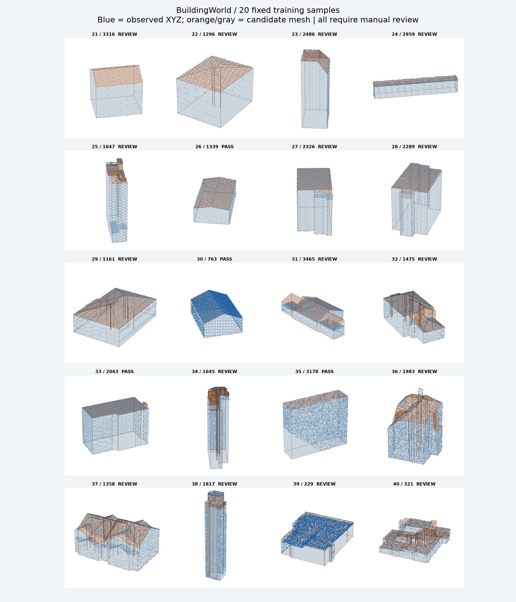

# BuildingWorld · XYZ → LOD2 OBJ

新对话接续：[分层项目记忆](memory.md) → 按任务读取状态、数据与经验。原 `PROJECT_MEMORY.md` 已保留历史副本并转为入口，避免旧环境数据数量误导当前工作。

**最新小试：** 全562对已按[筛选与统一预处理规范](docs/DATASET_METHODS_V001.md)整理。仅对固定78对运行首轮独立模型反馈实验：基准/F0成功71对，F3成功77对；30对同起点策略迁移两组均成功26对，未观察到演化收益。见[可视化结果与全部模型对比](reports/2026-09-21-starter78-feedback-pilot/index.html)、[实验记录](experiments/2026-09-21/starter78-feedback-pilot/summary.md)。5个算法版本独立冻结，完整训练432/封存130尚未重建；单候选单种子不构成机制已证实的结论。

**立面数据已入库：** Point2Building Zurich 28,415 对真实 ALS/参考 Mesh、PolyGNN mini 200 对仿真 ALS/Mesh，原始数据仅保存在本地。已整理 78 对经过当前质量筛选的入门样例；见[数据说明](docs/DATA_ACQUISITION.md)和[立面数据审核报告](reports/2026-09-21-dataset-audit/index.html)。这些作者参考模型不等于已获取比赛测试真值。

**2026-09-21 研究分支：** 新增 [LoD2 RSI 完整研究协议](docs/RSI_RESEARCH_PLAN.md)、[Harness 用法](docs/HARNESS_USAGE.md)、[文献证据矩阵](docs/LITERATURE_REVIEW_RSI.md)及[第一阶段可视化报告](reports/2026-09-21-stage01/index.html)。从 v0.1.0 重新固定基准；第一轮凹轮廓候选 11 改善、6 持平、2 退化、1 失败，未采用。当前是流程实测，尚未证明递归自我改进或完成正式消融。

单栋机载 LiDAR 点云转建筑网格的几何重建原型。输入为三列 XYZ，输出为保留原始坐标的 OBJ 和结构化 JSON。当前算法 **v0.5.1**，含本地网页、历史模型、渲染图与验证报告。

优先贴合实际轮廓、凹角、低坡屋顶和局部结构。立面依据已观测边界、垂直性和局部平面延续推断；没有证据时不虚构窗户和装饰。模型仍有开放边、非流形接缝和局部分面错误，当前是供人工审查的候选结果。

## 快速开始

建议 Python 3.11+，在仓库根目录执行：

```sh
python -m venv .venv
# 激活环境后安装：
python -m pip install -r webapp/requirements.txt
python pointcloud_to_mesh.py path/to/input.xyz work/example/model.obj
python webapp/server.py --port 8765
```

浏览器打开 <http://127.0.0.1:8765>，上传 XYZ、检查点云/网格叠加、下载 OBJ。Windows 也可运行 `webapp/start.ps1`；优先使用项目虚拟环境，其次使用本机已有运行时。

```sh
python pointcloud_to_mesh.py input.xyz work/example/model.obj --noise off
python pointcloud_to_mesh.py input.xyz work/example/model.obj --ground-z -5
```

底高应使用可信地面数据；默认最低观测点只能作为假设。依赖版本记录见 [运行环境](docs/ENVIRONMENT.md)。

## 文件结构

```text
data/inputs/                 原始训练 xyz / 测试 LiDAR_xyz（本地）
data/archives/               原始压缩包（本地）
data/references/             论文和数据说明（本地）
work/audit/                  点云清单、审计、论文提取（本地）
work/experiments/            新实验、中间过程产物（本地）
work/legacy_output/          整理前的完整输出备份（本地）
work/runtime/               本机依赖、网页任务、日志（本地）
releases/<version>/          分版本交付
  models/ renders/ reports/ docs/ source/ packages/ scenes/
scripts/buildingworld/       数据审计、批处理、验证、Blender 脚本
webapp/                     本地网页与计算服务
pointcloud_to_mesh.py        当前单文件几何重建入口
PROJECT_MEMORY.md            项目记忆与继续工作约束
```

GitHub 不包含原始点云、上传任务、数据压缩包、依赖目录和含点云的 Blender 场景。没有原始数据时，网页仍可显示归档网格与报告；自行补齐数据后可显示叠加。

## 历史版本

| 版本 | 主模型 | 全部代理门槛通过 | 用途 |
|---|---:|---:|---|
| [v0.1.0-baseline](releases/v0.1.0-baseline/docs/README.md) | 3 | 不适用 | 过度简化的初版基线 |
| [v0.2.0-contour](releases/v0.2.0-contour/docs/README.md) | 3 | 历史三样例通过 | 轮廓与立面证据修订 |
| [v0.4.1-batch01](releases/v0.4.1-batch01/docs/README.md) | 20 | 1 / 20 | 第一批人工审查 |
| [v0.5.1-batch02](releases/v0.5.1-batch02/docs/README.md) | 20 + 6 个复查模型 | 4 / 20 | 保守去噪与低坡修订 |

0.1.0/0.2.0 为本次整理赋予的历史归档编号，不代表当时已经发布软件版本。每个版本的 `index.html` 可离线打开；GitHub 上可直接查看 renders 图片和下载 packages/models.zip。历史 OBJ 未重新生成。



## 评分与验证

目标为最小化 **0.6 × CD + 0.4 × ECD**，同时记录 NC、V_Ratio、F_Ratio。尚无真值建筑网格和官方评测脚本，所以没有官方分数；点面 P95、轮廓 IoU、局部覆盖率与拓扑门槛均为工程代理，不能替代官方 CD/ECD。

规则与算法见 [算法文档](docs/BUILDING_RECONSTRUCTION_ALGORITHM.md)、[验证阈值](docs/validation_rules.json)、[项目记忆](PROJECT_MEMORY.md)。后续修改须同时复查固定样本与用户圈选的 1321、144，并按新版本保存，不覆盖历史交付。

## 数据与授权

这是针对 BuildingWorld 点云的实验项目，不是数据集官方仓库。原始数据与论文不随仓库分发，数据使用须遵守原始来源条款。本仓库暂未添加开源许可证；公开可见不等于授予数据或代码再分发许可。
